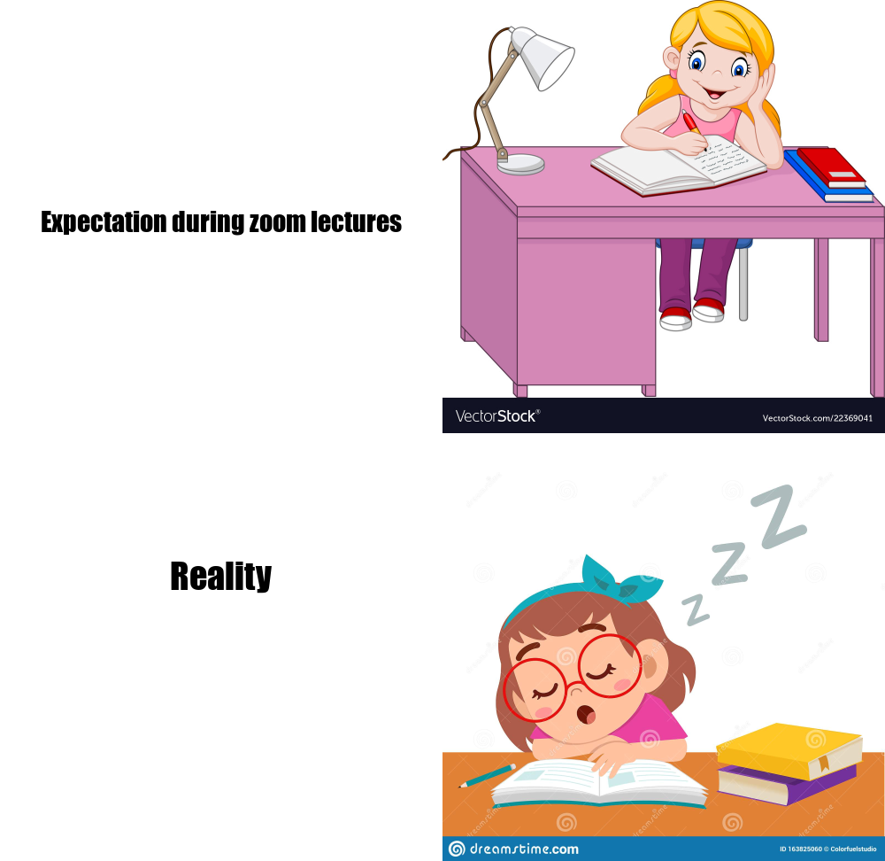

```{r
library(magick)

pic1 <- image_read("https://cdn2.vectorstock.com/i/1000x1000/90/41/cartoon-little-girl-studying-vector-22369041.jpg") %>%
  image_scale(500) 

first_text <- image_blank(width = 500, height = 500, color = "#ffffff") %>%
  image_annotate(text = "Expectation during zoom lectures", color = "#000000", 
                 size = 30, font = "Impact", gravity = "center")

pic2 <- image_read("https://thumbs.dreamstime.com/z/happy-cute-girl-sleep-study-class-vector-163825060.jpg") %>%
  image_scale(500)

second_text <- left_text <- image_blank(width = 500, height = 300, color = "#ffffff") %>%
  image_annotate(text = "Reality", color = "#000000", 
                 size = 40, font = "Impact", gravity = "center")

first_row <- c(first_text, pic1) %>%
  image_append()

second_row <- c(second_text, pic2) %>%
  image_append()

meme <- c(first_row, second_row) %>%
  image_append(stack = TRUE)

image_write(meme, "my_meme.png")

```

<center>  </center>


## This meme was inspired by the university’s current learning environment in response to the uncertainty that covid 19 outbreaks come with. It is of course an adaptation of other memes on the web that are about how different reality is from the expectations. 

### Here are two relatable expectation vs reality: 

1. 


2. 

